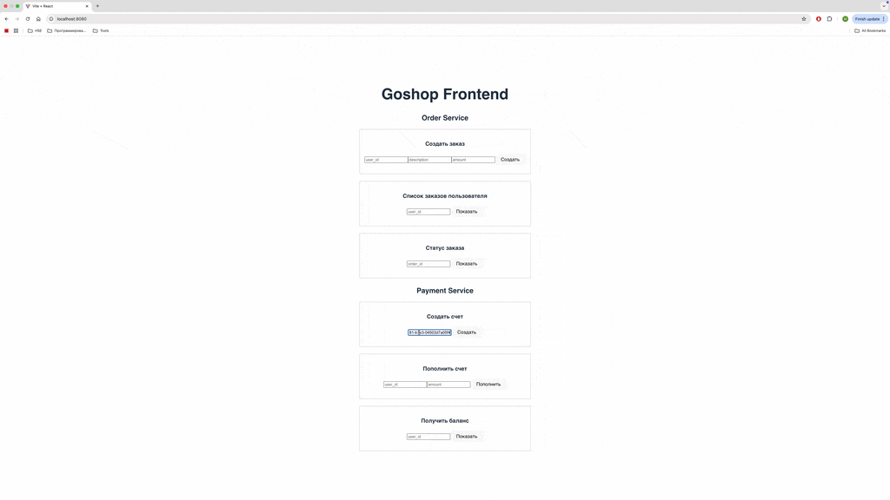

# Goshop

Goshop — интернет-магазин, построенный на микросервисной архитектуре. Проект включает два ключевых сервиса:

- **Payments Service** — управление счетами пользователей (создание счета, пополнение, просмотр баланса).
- **Orders Service** — работа с заказами (создание заказа с асинхронной оплатой, просмотр заказов и статусов).

## Архитектурные особенности

- Для обеспечения надежной доставки и обработки сообщений между сервисами реализованы паттерны [Inbox](shared/inbox/) и [Outbox](shared/outbox/).
- Для транзакций используется [golang context](shared/txs/).
- Гарантируется семантика **exactly once** при обработке платежей с помощью ключей идемпотентности.
- Баланс пользователя защищен от коллизий при параллельных операциях с помощью атомарных инструкций или транзакций.

## Краткое описание функционала

### Payments Service

- Создание счета (один счет на пользователя)
- Пополнение счета
- Просмотр баланса

### Orders Service

- Создание заказа (асинхронно инициирует оплату)
- Просмотр списка заказов
- Просмотр статуса заказа

## Gateway

Используется grpc-gateway для маршрутизации запросов к соответствующим сервисам. Он обеспечивает единый интерфейс для взаимодействия с микросервисами и упрощает клиентскую интеграцию.

## Фронтенд

Фронтенд написан на [React](https://react.dev/) с использованием [Vite](https://vitejs.dev/) на минимальном шаблоне. Он взаимодействует с сервисами через REST API (gateway).



## Запуск проекта

```bash
docker compose --profile prod up --build
```
